# Recipe Box for Home Assistant

A self-hosted recipe ingester + dashboard card for Home Assistant.
Import recipes from URLs, paste, PDFs, or photos. Browse, search,
edit, and cook from a phone or desktop dashboard. Send ingredients to
OurGroceries (or any todo entity) with smart quantity stripping.

Recipes live as portable schema.org Recipe JSON-LD on a folder you
control — typically an SMB share — so the data survives any tool
migration.


<!-- SCREENSHOT: hero showing library + detail side-by-side -->
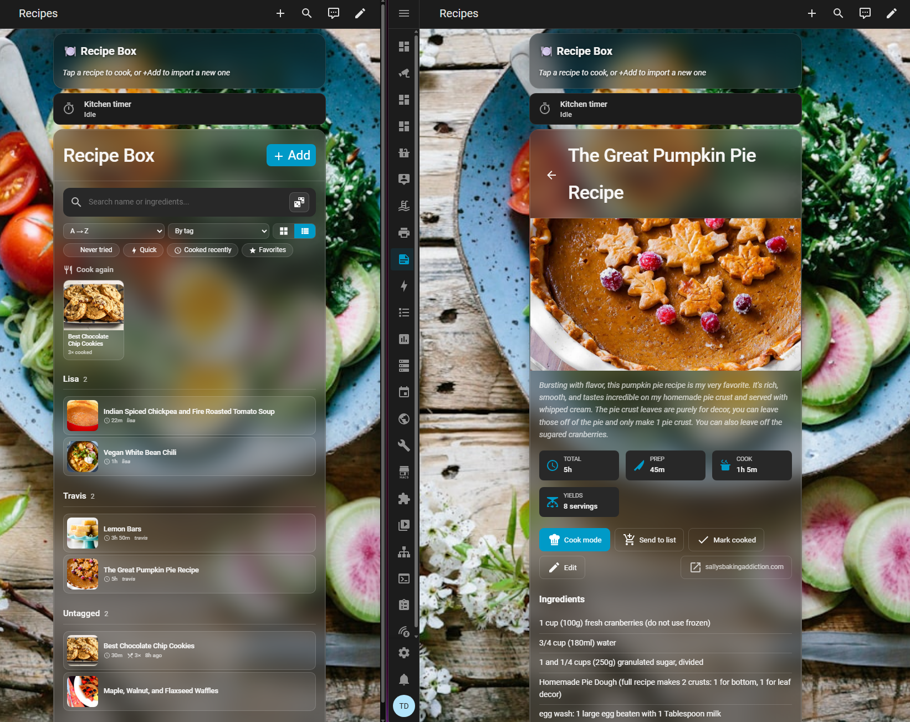

## Features

**Multiple import paths**
- URL — backend fetches and parses (uses [recipe-scrapers](https://github.com/hhursev/recipe-scrapers))
- Paste text — for sites blocked by Cloudflare/bot protection. Copy the recipe text from your browser, paste, parse.
- PDF / photo upload — store the document alongside the metadata, inline viewer in the detail view
- Phone share sheet — fires `mobile_app.share`, blueprint imports it automatically

**Library organization**
- Search across recipe names AND ingredient text
- Sort by name / recently added / last cooked / most cooked / quickest
- Group by tag, category, or source type
- Quick-filter chips: Never tried, Quick (≤30 min), Cooked recently, Favorites
- Toggle between image-grid and compact list view
- "Cook again" carousel of your most-cooked recipes
- 🎲 Random recipe picker (respects active filters)

**Smart shopping list**
- Sends `flour` instead of `2 1/4 cups all-purpose flour`. Compact-by-default, full-line toggle available
- Per-row text editing before send
- Fuzzy-dedup against what's already on the list
- Last-list memory across recipes

**Other**
- Edit-in-place — name, description, image URL, ingredients, instructions, tags, notes
- Cook mode — full-screen step-by-step with screen wakeLock and auto-detected timers
- Hand-editable storage — `vim recipe.json` to fix a typo, watchdog observer reloads automatically
- Future-proof format — schema.org Recipe JSON-LD, readable by Mealie / Tandoor / Paprika

## Installation

This repo contains both an **integration** (the backend) and a
**Lovelace card** (the dashboard UI). HACS treats them as separate
items, so you'll add this repo URL to HACS twice — once as
*Integration*, once as *Lovelace*. Same URL both times.

### 1. Install the integration

1. **HACS → Integrations → ⋮ → Custom repositories**
2. Repository URL: `https://github.com/builtbyfood/recipe-box`
3. Type: **Integration**
4. **Add → search "Recipe Box" → install**
5. **Restart Home Assistant**
6. **Settings → Devices & Services → Add Integration → Recipe Box**
7. Enter `recipes_path` — an absolute path where recipes will be
   stored, e.g. `/media/recipes/`. The folder is created if it doesn't
   exist.

### 2. Install the dashboard card

1. **HACS → Frontend → ⋮ → Custom repositories**
2. Repository URL: `https://github.com/builtbyfood/recipe-box`  ← same URL
3. Type: **Lovelace**
4. **Add → search "Recipe Box" → install**
5. Hard-refresh your dashboard (Ctrl/Cmd-Shift-R)

The card auto-registers as a dashboard resource — no manual resource
configuration needed.

### 3. (Optional) Install the share-sheet automation

1. Open this URL in a browser logged into your HA:
   ```
   https://my.home-assistant.io/redirect/blueprint_import/?blueprint_url=https%3A%2F%2Fgithub.com%builtbyfood%2Frecipe-box%2Fblob%2Fmain%2Fblueprints%2Fshare-event.yaml
   ```
2. Click **Import Blueprint**, then **Create Automation** from it
3. Fill in the form (notify target, dashboard path, conflict mode), Save

After that, sharing any URL or text from another app to "Home
Assistant" in your phone's share sheet imports it as a recipe and
sends a deep-link notification.

## Quick start

Paste this into any Lovelace dashboard view to get a working library:

```yaml
- type: custom:recipe-box-card
  view: library
  columns: 1            # 1 for mobile, 3-4 for desktop
  group_by: tag         # none | tag | category | source
  show_filters: true    # tag chips above the grid
  default_todo: todo.<your_shopping_list>   # CONFIGURE
  title: Recipe Box
```

> Replace `todo.<your_shopping_list>` with your shopping-list entity.
> Find it in Developer Tools → States → filter `todo.`.

## Card configuration

```yaml
type: custom:recipe-box-card
view: library             # library (default) | detail | cook | import
columns: 4                # grid column count
show_filters: true        # tag chips above the grid
group_by: none            # none | tag | category | source
default_todo: todo.<your_shopping_list>
title: Recipe Box
recipe_id: my-cookies     # only for view: detail or view: cook
```

The library has runtime dropdowns for sort/group/view-mode that
override the config defaults and persist per browser to localStorage.

## Examples

The [`examples/`](examples/) folder has paste-ready dashboard YAMLs
and the share automation source:

- [`mobile-dashboard.yaml`](examples/mobile-dashboard.yaml) —
  glassmorphism mobile layout with food background
- [`desktop-dashboard.yaml`](examples/desktop-dashboard.yaml) —
  3-column grid with shopping list panel
- [`share-event-automation.yaml`](examples/share-event-automation.yaml) —
  raw automation source (use the blueprint import above unless you
  want to customize)
- [`bookmarklet.js`](examples/bookmarklet.js) — browser bookmark for
  desktop or non-Companion setups

Each YAML has `# CONFIGURE` comments marking the entity IDs you need
to edit.

## Services

| Service | What it does |
|---|---|
| `recipe_box.add_from_url` | Fetch + parse a URL, save the recipe. Accepts optional `html` (pre-fetched HTML) or `text` (free-text paste) instead of a URL. |
| `recipe_box.add_to_list` | Add ingredients to a todo list. Compact mode by default. |
| `recipe_box.mark_cooked` | Increment `cooked_count`, stamp `last_cooked`. |
| `recipe_box.delete` | Delete a recipe and its files. |
| `recipe_box.refresh` | Force-rescan the recipes folder. |

See [`custom_components/recipe_box/services.yaml`](custom_components/recipe_box/services.yaml)
or HA Developer Tools → Services UI for full schemas.

## Mobile import — share sheet

The Home Assistant Companion app for Android registers itself as a
share target. Any URL or text shared from another app fires a
`mobile_app.share` event. The blueprint imports it.

**To trigger:**

1. Open any recipe in your phone's browser
2. Tap **Share** → scroll to **Home Assistant**
3. Within ~2 seconds, a notification fires with an "Open" button that
   deep-links to the imported recipe in your dashboard

For Cloudflare-protected sites where URL fetch fails, **select the
recipe content first**, then **Share text**. The text routes through
the parser instead of the URL fetch.

<!-- SCREENSHOT: phone share sheet showing Home Assistant -->


## Recipe storage layout

Recipes are JSON files plus optional images/PDFs in per-recipe
subfolders. Typical setup uses an SMB share so the data is portable
and backed up:

```
\\<your-nas>\recipes               ← share on your NAS
↓ mounted via Samba addon, Network Storage, or container bind mount

/media/recipes/                     ← what you put in `recipes_path`
  chocolate-chip-cookies/
    recipe.json
    hero.jpg
  grandmas-meatloaf/
    recipe.json
    source.jpg                      ← photo of the printed recipe
```

Local paths like `/config/recipes/` work the same way if you don't
have a NAS. See [`docs/SCHEMA.md`](docs/SCHEMA.md) for the full
schema reference.

## More screenshots

<!-- SCREENSHOT: detail view -->
**Detail view**
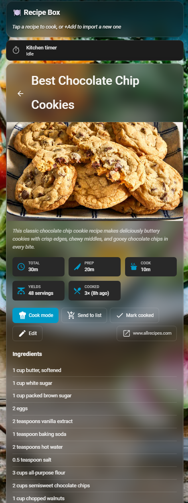
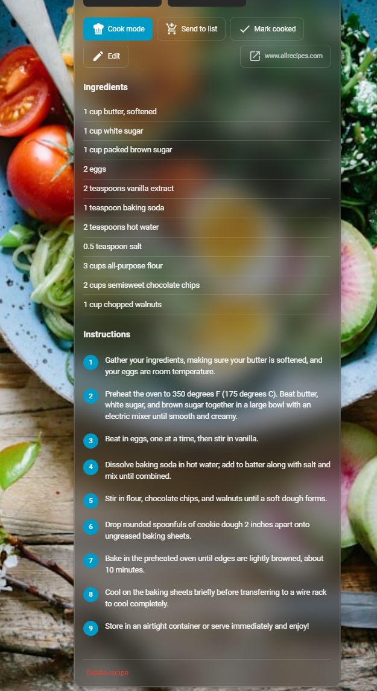

<!-- SCREENSHOT: cook mode -->
**Cook mode**
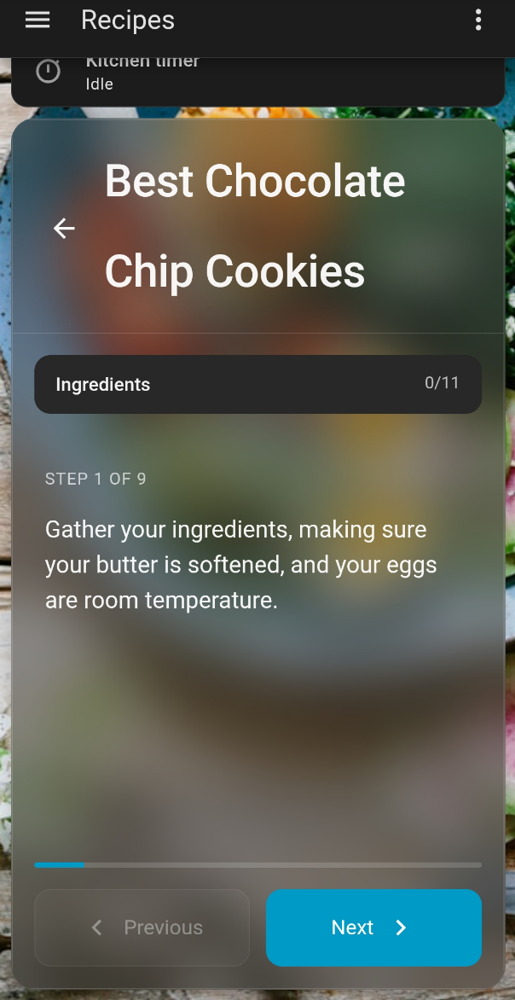
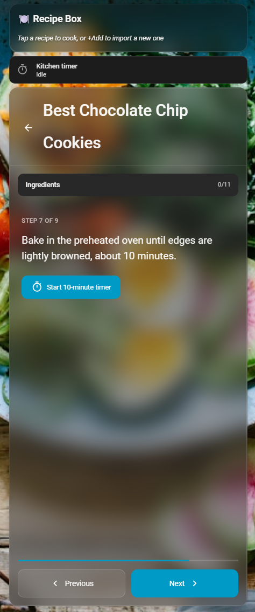

<!-- SCREENSHOT: send-to-list panel -->
**Send to list**
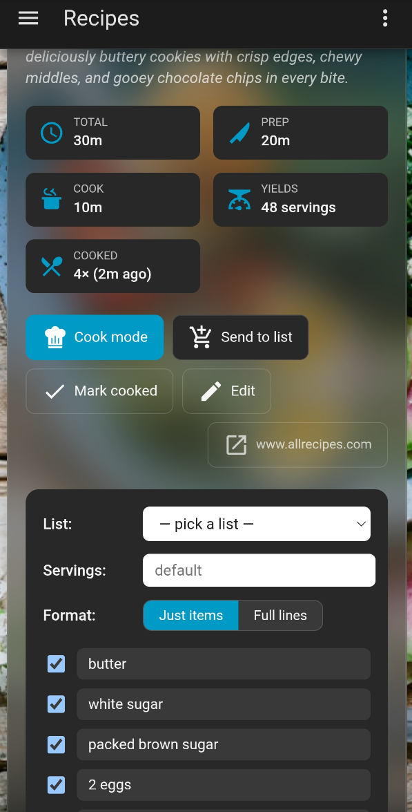
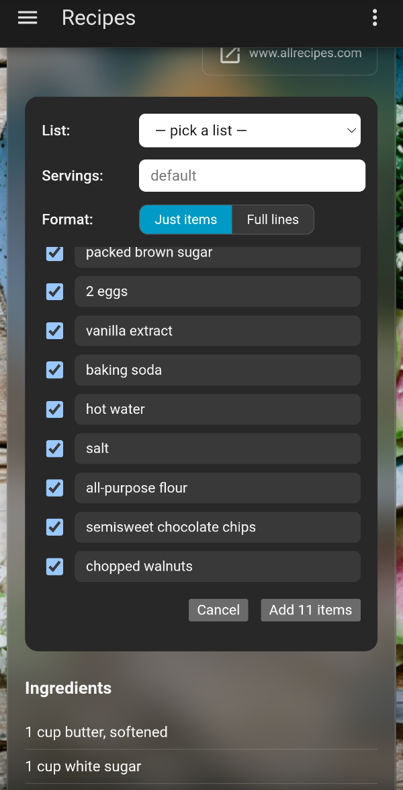

<!-- SCREENSHOT: 3-tab import -->
**Import dialog**
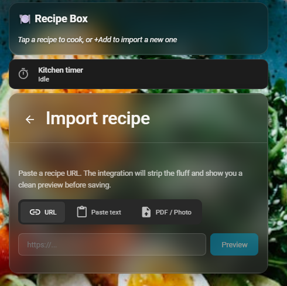

<!-- SCREENSHOT: edit mode with image URL field -->
**Edit mode**
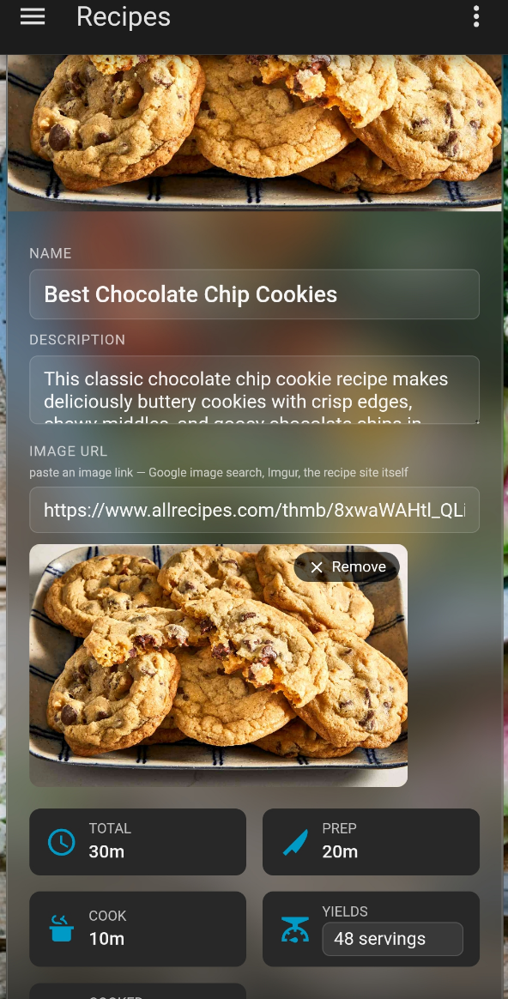
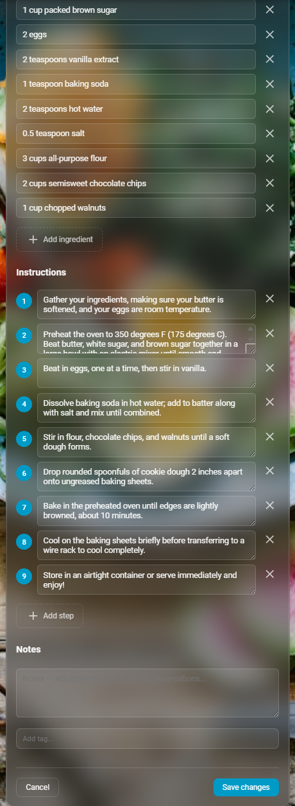

<!-- SCREENSHOT: import notification on phone -->
**Phone notification after share-sheet import**
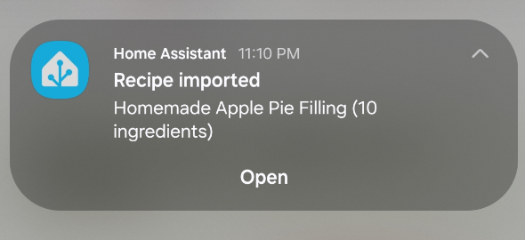

## HTTP API

Endpoints under `/api/recipe_box`. All require HA auth.

| Endpoint | Purpose |
|---|---|
| `POST /preview` | Parse a URL/HTML/text without saving. |
| `GET /recipes` | List all recipes (summary form). |
| `POST /recipes` | Save a reviewed recipe. |
| `GET /recipes/{slug}` | Full recipe. |
| `PUT /recipes/{slug}` | Update recipe fields. |
| `DELETE /recipes/{slug}` | Delete. |
| `POST /recipes/{slug}/cooked` | Mark cooked. |
| `POST /recipes/{slug}/shopping_preview` | Preview scaled+deduped+compacted ingredients. |
| `POST /upload` | Upload a PDF or image (base64), creates a recipe shell. |
| `GET /recipes/{slug}/attachment` | Stream the attached PDF/image. |

## Development

The integration is Python 3, the card is TypeScript + Lit + Rollup.

```bash
# Build the card
npm install
npm run build       # one-shot
npm run watch       # rebuild on save during development

# Test the parser standalone (no HA needed)
pip install recipe-scrapers requests
python tests/test_parser.py https://example.com/some/recipe
```

The built card lives at `dist/recipe-box-card.js`. HACS pulls this
file directly, so commit it after every release.

## Status

`v0.3.0` — first public release. Three-tab import, edit-in-place,
library grouping/sorting/filtering, smart compact shopping list,
share-sheet import, cook mode with auto-timers.

See [CHANGELOG.md](CHANGELOG.md) for the full history.

## License

MIT — see [LICENSE](LICENSE).
